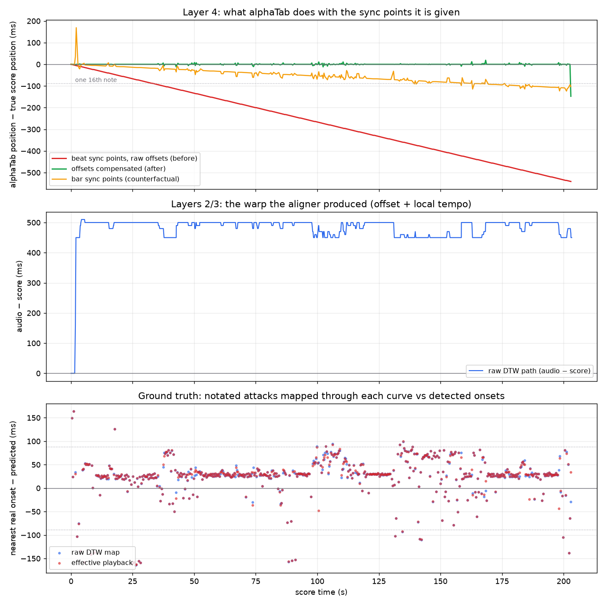

# Sync audit #3 — whole-song drift was millisecond truncation inside alphaTab

_Follow-up to [`sync-audit-2.md`](./sync-audit-2.md). Symptom: on a 170 BPM song
the cursor starts close, is visibly out by a few measures in, and keeps getting
worse. Treated as a whole-song problem, not an endpoint one._

**Verdict: none of the alignment layers were at fault.** The GP timeline, the
DTW path and the sync map all measured clean. Every millisecond of drift was
introduced *after* the map was handed to alphaTab, by an integer truncation in
`MidiUtils.ticksToMillis` that our beat-level sync points hit 576 times per song.

---

## 1. Measuring before changing anything

The player's on-screen **Error** readout cannot localise this. It compares our
`SyncMap` against alphaTab's copy of it while both are moving, so it says
*something* disagrees, never *which layer*. Four timelines had to be separated:

| layer | measured against the score timeline | result |
| --- | --- | --- |
| 1. GP / alphaTab timing | `bars.json` float integration vs alphaTab's own tick→ms model | **0.000 ms** across all 144 bars |
| 2→3. raw DTW → final map | after `buildPlaybackSyncMap` + sanitize/simplify + `toAlphaTabBarSyncPoints` | **0.00 ms**, no repairs (1357 → 577 points) |
| 2. raw DTW vs real onsets | 474 notated attacks, `evaluate.py` | median 7.3 ms, p90 51.5 ms, trend **+0.08 ms/s** |
| 4. effective playback vs real onsets | what the cursor actually does | median 38.9 ms, p90 97.7 ms, 200 subdivision slips |

`align/probe-playback.mjs` was written for this: it reproduces alphaTab's
playback math offline (`MidiFileGenerator._processBarTimeWithSyncPoints` and
`MidiFileSequencer.mainTimePositionFromBackingTrack`) so layer 4 can be measured
without a browser, and writes `sync-effective.json` — the mapping playback
*really* implements — so `evaluate.py` can score it against detected onsets
exactly as it scores the DTW map.

Layer 4's error versus score time is a straight line. A least-squares fit gives
**−2.6666 ms/s** and the largest deviation of the real curve from that line is
**0.51 ms** over the whole song:

| score time | 30 s | 60 s | 120 s | 180 s | end (203 s) |
| --- | --- | --- | --- | --- | --- |
| cursor behind the music | −80 ms | −160 ms | −320 ms | −480 ms | −541 ms |

Divergence starts at bar 1 and never stops — there is no first bad measure. It
passes 20 ms at bar 6, half a sixteenth at bar 13, a full sixteenth (88 ms) at
bar 24 and a full eighth at bar 48. Score model verified clean along the way:
144 master bars, 144 played, no repeats, 4/4 throughout, one tempo automation
(170 BPM at bar 1), `tickShift` 0, and `bars.json` agreeing with alphaTab's tick
model to the microsecond at 203.294118 s.

---

## 2. Root cause

alphaTab keeps **two clocks for the same score** and they disagreed.

The cursor's clock, `MidiFileSequencer.createStateFromFile`, walks the MIDI
events and accumulates in floating point — exact:

```js
absTime += deltaTick * (6e4 / (bpm * midiFile.division));
```

The sync-point clock is built somewhere else entirely,
`MidiFileGenerator._processBarTimeWithSyncPoints`, and accumulates through:

```js
static ticksToMillis(ticks, tempo) {
	return ticks * (6e4 / (tempo * MidiUtils.QuarterTime)) | 0;   // ← truncates
}
```

The `| 0` truncates to whole milliseconds, and the helper is called **once per
gap between consecutive sync points**, not once for the song. We send one point
per beat. At 170 BPM a beat is 352.941 ms, banked as 352:

```
0.941 ms lost per beat × 2.833 beats/s = 2.667 ms/s   (measured: 2.6666)
0.941 ms × 576 beats                   = 542 ms       (measured: 541)
```

So when the recording reached 74.265 s the sync points told alphaTab "you are at
score second 73.588"; the cursor's float clock drew that as a genuinely earlier
musical position, and the cursor sat an eighth note behind the band.

**The density of sync points is the multiplier.** Re-running the probe with
`--grid bars` gives −0.55 ms/s / −103 ms — exactly one quarter, because there
are four beats to a bar. Beat-level sampling was introduced in audit #2 to stop
*intra-bar* drift (a 4/4 bar at 170 BPM is 1.41 s of linear interpolation); it
worked, and paid for it with a 5× worse whole-song drift that nothing measured.

---

## 3. The fix

`synthTime` is derived from ticks and tempo alone — it never depends on the
millisecond offsets we send. So it can be read back and the offsets re-derived
against alphaTab's own belief about where each point sits:

1. `score.applyFlatSyncPoints(points)` with offsets sampled from the curve as before.
2. `MidiFileGenerator.generateSyncPoints(score)` returns what alphaTab made of them, including each point's `synthTime`.
3. For each point, replace the offset with the curve evaluated **at that `synthTime`** instead of at the true beat time. If alphaTab thinks beat 200 is at 70.412 s when it is really at 70.600 s, hand it the audio time the map assigns to 70.412 s.
4. Apply once more.

One pass is exact: step 4 cannot move `synthTime` again. The two clocks are
forced to agree wherever a sync point exists, which is every beat, so there is
nothing left to accumulate in between.

- `compensateFlatSyncPoints` — `features/player/data/syncMap.ts`
- called from `BackingMediaSync.applySync` — `features/player/data/backingSync.ts`
- generator supplied by `AlphaTabPlayer` from its alphaTab module ref
- skipped harmlessly when the map or the generated points are unavailable

---

## 4. Result



Top panel: red is the shipped behaviour before the fix, green after, orange the
bar-grid counterfactual. Bottom panel: the playback points now sit on top of the
map points — the transfer is lossless and what you hear is the map's own quality.

| | median \|residual\| | p90 | subdivision slips |
| --- | --- | --- | --- |
| raw DTW map (the ceiling) | 7.3 ms | 51.5 ms | 85 |
| playback before | 38.9 ms | 97.7 ms | 200 |
| playback after | **7.0 ms** | **51.6 ms** | **77** |

Drift trend after the fix: **+0.002 ms/s**, mean +0.04 ms, worst 18.8 ms across
576 beats. In the player the live Error readout now hovers around ±10 ms for the
whole song instead of ramping to half a second.

---

## 5. Known remainders

**The final beat.** Still ~148 ms out, down from 541 ms. Once the offsets are
honest, the last beat's audio position falls *past* the last sync point into
alphaTab's tail branch, which interpolates between its truncated `synthTime` and
its exact `endTime` across the whole remaining file — the same branch audit #2
documented. Fixing it properly means reporting a different
`backingTrackDuration`, which also affects seeking.

**The bar-1 lead-in step.** The DTW path stays at exactly identity through bar 1,
then steps +450 ms inside bar 2 and holds a flat +500 ms for the rest of the
song. The recording is genuinely at the notated 170 BPM, so the entire alignment
is one lead-in offset that the path *walks* to instead of starting from. Bar 1
therefore plays about half a second early and bar 2 contains a 2.23× rate spike.

**Map quality.** 77 subdivision slips out of 474 measured beats, concentrated in
5–50 s and 100–150 s, where the median residual shifts by ~14 ms.

**Tempo dependence.** The old bug scaled with tempo — a slower song loses less
per beat — so songs that felt "fine" before were only less badly affected. Any
new fixture should be probed rather than eyeballed.

---

## 6. Reproducing

```bash
node align/gp-to-midi.mjs align/fixtures/monster/monster.gp align/.cache/drift

# librosa's numba cache and matplotlib both need writable dirs, or align.py
# fails at decode with "no locator available"
export NUMBA_CACHE_DIR="$PWD/align/.cache/numba" MPLCONFIGDIR="$PWD/align/.cache/mpl"
export ALIGN_SOUNDFONT=/path/to/GeneralUser-GS.sf2
align/.venv/bin/python align/align.py \
  --recording align/fixtures/monster/monster.mp3 \
  --midi align/.cache/drift/score.mid --bars align/.cache/drift/bars.json \
  --out align/.cache/drift/sync.json --require-soundfont

# layer-by-layer drift; --no-compensate for the old behaviour, --grid bars for
# the bar-level counterfactual
node --experimental-transform-types --import ./align/ts-resolve.mjs \
  align/probe-playback.mjs \
  --gp align/fixtures/monster/monster.gp \
  --bars align/.cache/drift/bars.json --sync align/.cache/drift/sync.json \
  --out align/.cache/drift/drift.json

# ground truth: playback vs detected onsets
align/.venv/bin/python align/evaluate.py \
  --recording align/fixtures/monster/monster.mp3 \
  --bars align/.cache/drift/bars.json \
  --sync align/.cache/drift/sync-effective.json \
  --midi align/.cache/drift/score.mid --positions beats

# the figure above
align/.venv/bin/python align/plot-drift.py --recording … --drift-before … --out drift.png
```

`align/ts-resolve.mjs` is a Node ESM resolve hook that lets these scripts import
the app's TypeScript unchanged (bundler-style extensionless imports).
